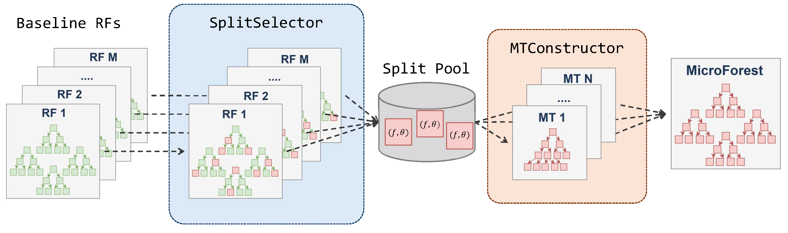
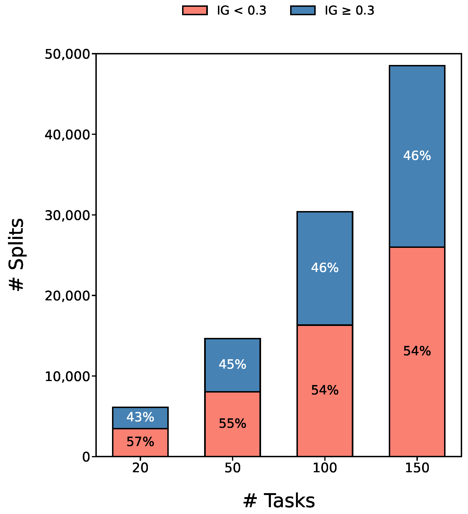
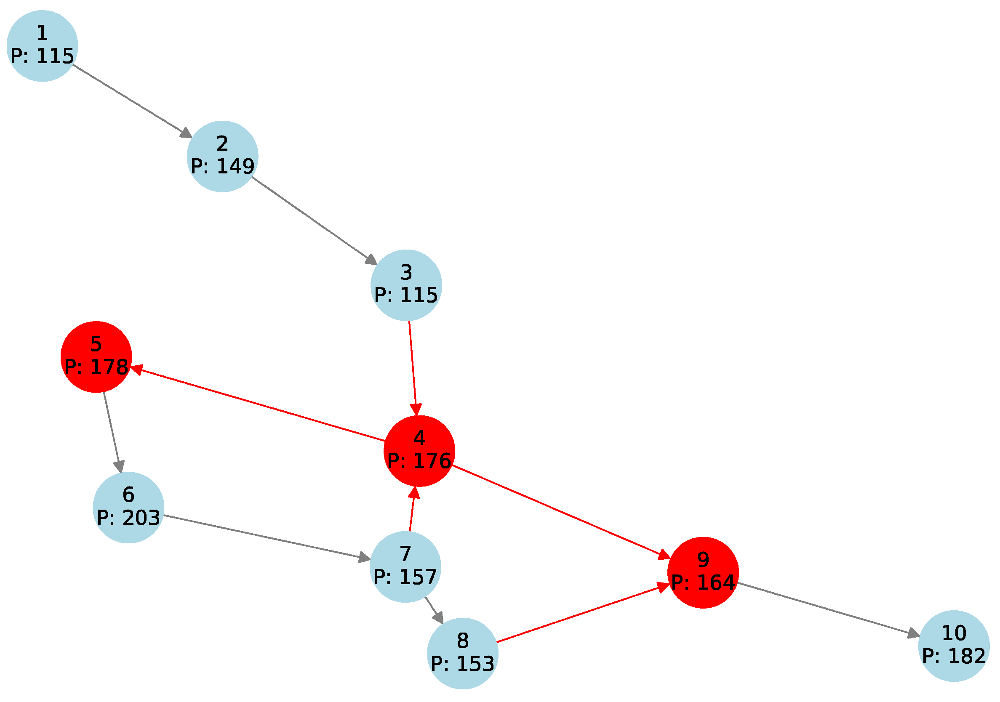

# MicroForest

이 저장소는 제가 1저자로 발표한 논문 **MicroForest: Lightweight Bottleneck Prediction for Manufacturing Processes on Edge Devices**의 핵심 아이디어를 구현한 코드입니다.

> Yoo, S.; Oh, C. *MicroForest: Lightweight Bottleneck Prediction for Manufacturing Processes on Edge Devices*. Applied Sciences 2025, 15, 7798. https://doi.org/10.3390/app15147798  
> 논문 그림은 원문에서 추출했으며, 원문 라이선스(CC BY 4.0)에 따라 출처를 명시해 포함했습니다.



## 핵심 아이디어

Random Forest 안에는 수많은 split이 있지만, 병목 예측에 실제로 큰 기여를 하는 split은 일부입니다. MicroForest는 task별 Random Forest teacher를 먼저 학습한 뒤, 정보이득이 큰 split rule만 뽑아 작은 `MicroTree`를 구성합니다. 최종 배포 모델에는 teacher RF를 들고 갈 필요가 없으므로 edge 환경에서 메모리와 추론 비용을 줄일 수 있습니다.



## 데이터는 어떻게 만들었나

데이터 생성 코드는 [microforest/simulation.py](microforest/simulation.py)에 있습니다. 논문의 제조 공정 설정을 반영해 공정을 DAG로 만들고, 이 DAG 위에서 discrete-event simulation을 돌려 feature와 label을 생성합니다.

현재 데이터 생성 절차는 다음과 같습니다.

1. `n_tasks`개의 작업 노드를 생성합니다.
2. 모든 노드가 앞선 노드 중 하나와 연결되도록 기본 edge를 만든 뒤, `edge_probability`에 따라 추가 edge를 넣어 DAG를 만듭니다.
3. 각 task에 nominal cycle time을 부여합니다.
4. edge마다 유한 buffer capacity와 initial buffer level을 부여합니다.
5. simulation step마다 task의 잔여 처리 시간, buffer 상태, 생산량, starvation/blockage 상태를 갱신합니다.
6. source task는 `source_release_probability`에 따라 원재료 투입 여부가 달라집니다.
7. task cycle time은 `cycle_time_jitter`로 약간 흔들립니다.
8. `failure_probability`에 따라 장비 downtime이 발생하고, repair time 동안 병목 상태로 기록됩니다.
9. 입력 buffer가 비어 있으면 starvation, 출력 buffer가 가득 차면 blockage로 기록합니다.
10. 현재 시점의 공정 상태를 feature로 저장하고, `horizon` 이후 `prediction_window` 안에 병목이 한 번이라도 발생하면 해당 task label을 1로 둡니다.

현재 feature에는 다음 정보가 들어갑니다.

- edge별 buffer level
- edge별 buffer fill ratio
- task별 remaining processing time
- task별 downtime remaining
- task별 누적 생산량
- task별 starvation count
- task별 blockage count
- task별 nominal cycle time

즉 label은 단순히 현재 병목 여부가 아니라, “현재 상태를 보고 미래 구간에서 task별 병목이 발생할지”를 맞히는 multi-task binary prediction입니다.



## 설치

Python 3.10 이상을 권장합니다. 제 로컬 검증은 Anaconda Python 3.12에서 수행했습니다.

```powershell
python -m pip install -r requirements.txt
```

일반 Windows Python에서 가상환경을 만들 경우:

```powershell
python -m venv .venv
.\.venv\Scripts\python.exe -m pip install -r requirements.txt
```

MSYS Python은 `numpy` wheel을 바로 사용하지 못해 소스 빌드로 빠질 수 있으므로 권장하지 않습니다.

## 빠른 동작 확인

```powershell
python scripts/smoke_test.py
```

제 로컬 smoke test 결과:

```text
MicroForest smoke test OK
tasks=8, edges=14, rows=120, features=76
macro_f1=0.608
teacher_nodes=496
microtree_nodes=88
```

## 데이터 생성

```powershell
python scripts/generate_dataset.py --tasks 20 --samples 500 --horizon 30 --prediction-window 5 --out data/sample.csv
```

주요 옵션:

- `--tasks`: 제조 공정 task 수
- `--samples`: 저장할 sample 수
- `--horizon`: 현재 시점에서 몇 cycle 뒤를 볼지
- `--prediction-window`: horizon 이후 몇 cycle 동안 병목 발생 여부를 label로 묶을지
- `--edge-probability`: DAG 추가 edge 밀도
- `--cycle-time-jitter`: cycle time 변동 폭
- `--failure-probability`: step당 장비 고장 확률
- `--source-release-probability`: source task 원재료 투입 확률

## MicroForest 학습

```powershell
python scripts/train_microforest.py --data data/sample.csv --tasks 20 --model-out artifacts/microforest.pkl
```

이 스크립트는 task별 Random Forest teacher를 학습하고, teacher 내부 split 중 정보이득 상위 rule을 추출한 뒤, 그 split pool만 사용해 task별 `MicroTree`를 구성합니다.

## RF / LGBM 비교

RF와 LightGBM baseline 비교 코드는 [scripts/compare_baselines.py](scripts/compare_baselines.py)에 있습니다.

비교 명령:

```powershell
python scripts/compare_baselines.py --tasks 20 --samples 1000 --horizon 30 --prediction-window 5 --rf-estimators 60 --rf-depth 7
```

실행 환경:

- Windows
- Anaconda Python 3.12.4
- NumPy 1.26.0
- scikit-learn 1.5.2
- LightGBM 4.6.0
- synthetic dataset: 1000 rows, 206 features, 20 tasks

> [!IMPORTANT]
> **MicroForest**  
> Macro Precision `0.709` · Macro Recall `0.714` · Macro F1 `0.702` · Train `10.285s` · Predict `0.0259s` · Pickle `113.7KB`

Baseline results:

- **Random Forest**: Macro Precision `0.718` · Macro Recall `0.805` · Macro F1 `0.742` · Train `4.063s` · Predict `0.4519s` · Pickle `3683.0KB`
- **LightGBM**: Macro Precision `0.717` · Macro Recall `0.783` · Macro F1 `0.744` · Train `5.077s` · Predict `0.0459s` · Pickle `2418.4KB`

해석:

- 현재 재구현 데이터에서는 RF/LGBM이 Macro F1에서 더 높습니다.
- MicroForest는 compact 모델 기준 pickle 크기가 RF 대비 약 3.1%, LGBM 대비 약 4.7% 수준입니다.
- MicroForest 추론 시간은 RF보다 훨씬 짧고, LGBM보다도 빠르게 측정되었습니다.
- 표의 MicroForest 크기는 teacher RF를 제거한 배포용 모델 기준입니다. 학습 과정에서는 teacher RF를 사용하지만, `MicroForest.discard_teachers()` 이후에는 `MicroTree`만 남깁니다.

비교 결과 파일은 다음 위치에 저장됩니다.

- [artifacts/baseline_comparison.csv](artifacts/baseline_comparison.csv)
- [artifacts/baseline_comparison.md](artifacts/baseline_comparison.md)

## 코드 구조

```text
microforest/
  data.py          CSV 저장 및 로딩
  metrics.py       binary / macro metric 계산
  models.py        SplitSelector, MicroTree, MicroForest
  simulation.py    DAG 제조 공정 시뮬레이터
scripts/
  generate_dataset.py
  smoke_test.py
  train_microforest.py
  compare_baselines.py
tests/
  test_pipeline.py
assets/
  paper-figure-001.png ... paper-figure-008.png
artifacts/
  baseline_comparison.csv
  baseline_comparison.md
```

## Citation

```bibtex
@article{yoo2025microforest,
  title = {MicroForest: Lightweight Bottleneck Prediction for Manufacturing Processes on Edge Devices},
  author = {Seungmin Yoo},
  journal = {Applied Sciences},
  volume = {15},
  number = {14},
  pages = {7798},
  year = {2025},
  doi = {10.3390/app15147798}
}
```
